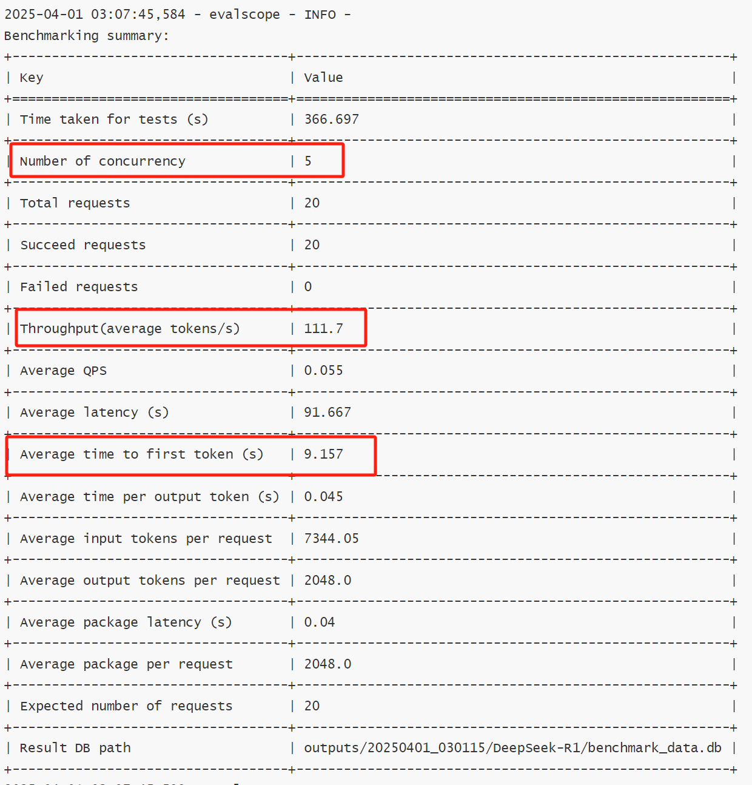

# Run deepseek on MI300
https://techcommunity.microsoft.com/blog/azurehighperformancecomputingblog/running-deepseek-r1-on-a-single-ndv5-mi300x-vm/4372726


## Create and config VM

```
az group create --location <REGION> -n <RESOURCE_GROUP_NAME>
az vm create --name mi300x --resource-group <RESOURCE_GROUP_NAME> --location <REGION> --image microsoft-dsvm:ubuntu-hpc:2204-rocm:22.04.2025030701 --size Standard_ND96isr_MI300X_v5 --security-type Standard --os-disk-size-gb 256 --os-disk-delete-option Delete --admin-username azureadmin --ssh-key-values <PUBLIC_SSH_PATH>
```

1. Prepare the NVMe disks in a RAID-0 configuration  
```
mkdir -p /mnt/resource_nvme/
sudo mdadm --create /dev/md128 -f --run --level 0 \
 --raid-devices 8 $(ls /dev/nvme*n1)  
sudo mkfs.xfs -f /dev/md128 
sudo mount /dev/md128 /mnt/resource_nvme 
sudo chmod 1777 /mnt/resource_nvme  
```

2. Configure HF to use the RAID-0
```
mkdir –p /mnt/resource_nvme/hf_cache 
export HF_HOME=/mnt/resource_nvme/hf_cache 
```

3. Configure Docker to use the RAID-0 
```
mkdir -p /mnt/resource_nvme/docker 
sudo tee /etc/docker/daemon.json > /dev/null <<EOF 
{ 
    "data-root": "/mnt/resource_nvme/docker" 
} 
EOF 
sudo chmod 0644 /etc/docker/daemon.json 
sudo systemctl restart docker 
```
## Run a docker
```
docker pull lmsysorg/sglang:v0.4.2-rocm620 

docker run \
  --device=/dev/kfd \
  --device=/dev/dri \
  --security-opt seccomp=unconfined \
  --cap-add=SYS_PTRACE \
  --group-add video \
  --privileged \
  --shm-size 32g \
  --ipc=host \
  -p 30000:30000 \
  -v /mnt/resource_nvme:/mnt/resource_nvme \
  -e HF_HOME=/mnt/resource_nvme/hf_cache \
  -e HSA_NO_SCRATCH_RECLAIM=1 \
  lmsysorg/sglang:v0.4.2-rocm620 \
  python3 -m sglang.launch_server \
  --model deepseek-ai/DeepSeek-R1 \
  --tp 8 trust-remote-code --host 0.0.0.0
```

## perf test with evalscope
https://evalscope.readthedocs.io/zh-cn/latest/get_started/basic_usage.html

```
evalscope perf \ --url http://xxxxxxx:30000/v1/chat/completions\ --model "deepseek-ai/DeepSeek-R1" \--parallel 5 \--number 20 \--api openai \--min-prompt-length 10000 \--dataset "longalpaca" \--max-tokens 2048 \--min-tokens 2048 \--stream

```

## perf improvement
1.Increased the CPU and memory allocation for the SGLang container. While this does not directly improve performance significantly, it helps somewhat when the throughput reaches its limit.
2.Enhanced the SGLang container's utilization of the NVMe disk, which also led to some performance improvement.
3.nabling the --enable-dp-attention option can improve overall throughput, though the effect is not as noticeable under low concurrency conditions.

